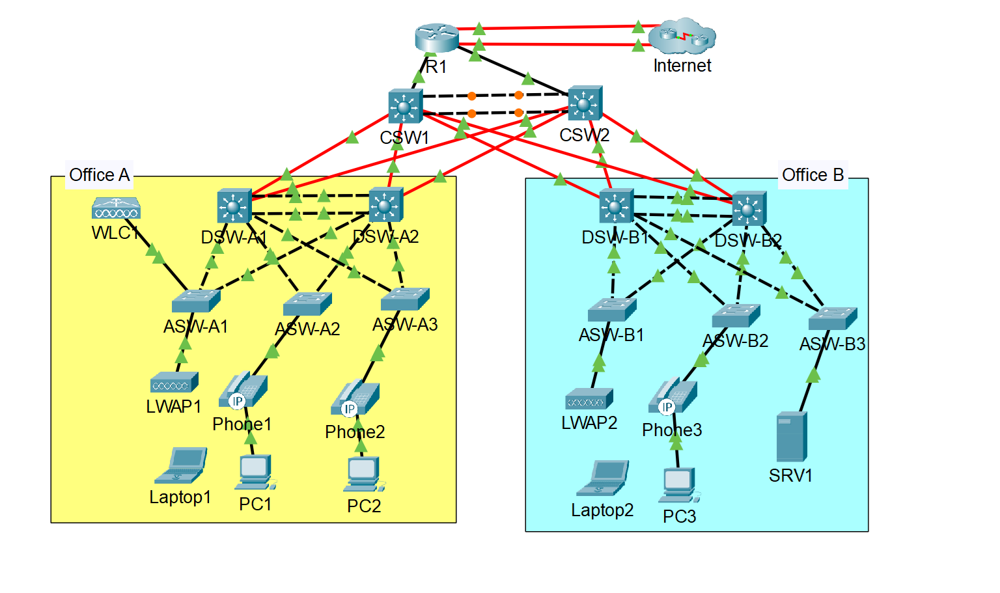

# Campus LAN Configuration (Cisco Packet Tracer)

## Overview
This project simulates a **campus network** using Cisco Packet Tracer.  
It demonstrates **VLAN segmentation, inter-VLAN routing, trunking, DHCP services, DNS, NAT, redundancy, ACLs, IPv4, IPv6, and more** in a hierarchical network design (Core–Distribution–Access).

---

## Repository Contents
- `/configs/` – Device configuration files (core, distribution, access, router, etc.)
- `Network-Diagram.png` – Network topology
- `Campus_LAN_Packet_Tracer.pka` – Cisco Packet Tracer project file

---

## Network Design
- **Core Layer:** High-speed routing and inter-VLAN connectivity  
- **Distribution Layer:** VLAN trunk aggregation and redundancy  
- **Access Layer:** End-user connectivity and access security  

**Key Technologies:**
- VLANs and Trunks  
- Inter-VLAN Routing
- Etherchannel
- Rapid Spanning Tree Protocol
- Static Routing and OSPF 
- HSRP
- DHCP
- DNS
- NTP
- SNMP
- Syslog
- SSH
- NAT
- ACLs and layer 2 security
- IPv4 and IPv6 routing

---

## Topology

*Designed and implemented using Cisco Packet Tracer.*

---

## Device Summary

| Device | Role | VLANs | IP Address | Notes |
|--------|------|--------|-------------|--------|

---

## Acknowledgments
The base topology for this project was originally created by **Jeremy’s IT Lab** as part of his CCNA Packet Tracer lab series.  
All configurations, documentation, and analysis in this repository were created independently by **Tyler Gibbs** for portfolio demonstration purposes.
